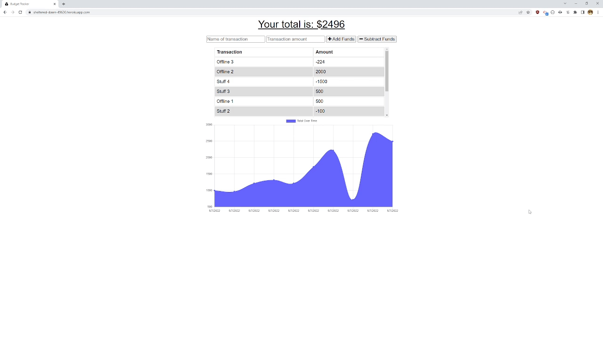

# Budget Tracker

[](https://opensource.org/licenses/MIT)

## Description
This application is a budget tracker that has been updated with Progressive Web Application (PWA) technology, to allow for offline access and functionality. Users are able to add deposits and expenses to the budget, with or without an Internet connection. Transactions entered while offline will update the budget total after the user is back online.

This app is written in JavaScript running on Node.js, and is publicly deployed on Heroku with MongoDB Atlas providing NoSQL backend database service. Offline database storage is facilitated via IndexedDB. Packages used include Express for web framework, and Mongoose for Object Document Modeling (ODM) work with the MongoDB backend.



## Table of Contents
- [Link to Deployed Application](#link-to-deployed-application)
- [User Story](#user-story)
- [Installation](#installation)
- [Usage](#usage)
- [Tests](#tests)
- [Author](#author)
- [License](#license)
- [Contributing](#contributing)
- [Questions](#questions)

## Link to Deployed Application

[https://sheltered-dawn-49630.herokuapp.com/](https://sheltered-dawn-49630.herokuapp.com/)

## User Story
This Budget Tracker PWA was created to meet the requirements of the following user story:
```
AS AN avid traveler
I WANT to be able to track my withdrawals and deposits with or without a data/Internet connection
SO THAT my account balance is accurate when I am traveling 
```

## Installation
If you would like to run the Budget Tracker locally instead of visiting the deployed application, follow these steps:

 1. Clone the repository, or download and extract an archive of it
 2. Run "npm install" to obtain the required dependencies
 3. Ensure you have a local instance of MongoDB running for the app to use

## Usage
 1. Invoke the app with "npm start" or "node server.js"
 2. Visit http://localhost:3001/ to begin using the application

## Tests
There is no test suite included with this application

## Author
Application written by Daniel Birmingham ([GitHub profile](https://github.com/Prolix19/))

## License
[The MIT License](https://opensource.org/licenses/MIT)

## Contributing
This project is not open to contributions at this time

## Questions
You may reach me via email at 51418825+Prolix19@users.noreply.github.com with any additional questions you may have